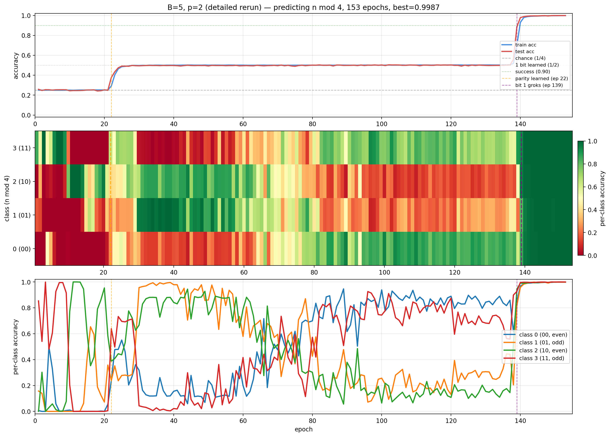
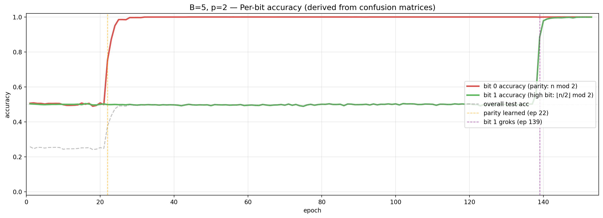
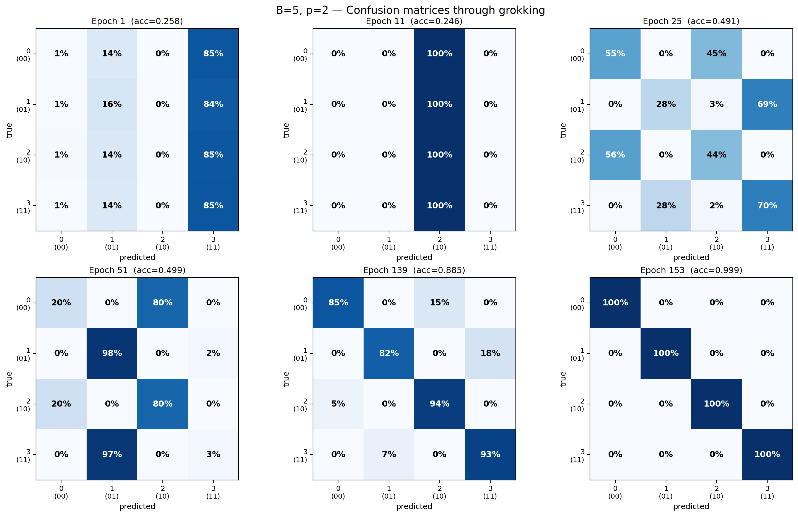

# B=5, p=2 — detailed grokking analysis

Predicting `n mod 4` from base-5 digits. This run uses the updated
`train.py` with per-epoch confusion matrices and per-sample prediction
snapshots. 153 epochs, best_acc=0.9987.

Data: `binary_suffix_experiment/detailed_rerun/B5_p2_results.json` and
`B5_p2_snapshots.json`.

## The bit-by-bit learning story



Three-panel overview with annotated transition points. Orange line =
epoch 22 (parity learned). Purple line = epoch 139 (bit 1 groks).

The model learns `n mod 4` in exactly two discrete steps:

1. **Epoch 22: parity (bit 0) is learned.** Test accuracy jumps from
   ~0.25 (chance) to ~0.50. The model can now distinguish even from odd
   but cannot tell 0 from 2 or 1 from 3.
2. **Epoch 139: bit 1 groks.** Test accuracy jumps from ~0.50 to ~0.99
   in 3 epochs. The model can now distinguish all 4 classes.

Between these two steps is a **115-epoch plateau** where the model knows
parity perfectly but is stuck.

## Per-bit accuracy



This figure directly measures whether each bit of `n mod 4` is
predicted correctly, derived from the confusion matrix at each epoch:

- **Bit 0 accuracy** (red) = fraction of predictions where the model's
  output has the correct parity (i.e., `pred mod 2 == true mod 2`).
- **Bit 1 accuracy** (green) = fraction where the model gets the high
  bit right (i.e., `pred // 2 == true // 2`).

**Bit 0 snaps to ~1.0 at epoch 22 and stays there.** The model never
makes a parity error again after this point.

**Bit 1 stays at exactly 0.50 (chance) until epoch 139**, then jumps to
~1.0. During the plateau, the model is literally guessing on bit 1
while getting bit 0 right every time.

This is the cleanest possible evidence for **progressive bit learning**:
the two bits of `n mod 4` are learned sequentially, not simultaneously,
with a long plateau between them.

## Confusion matrices through grokking



Six snapshots showing how the model's predictions evolve:

**Epoch 1 (acc=0.258) — class collapse.** The model predicts class 3
for ~85% of inputs regardless of true label. All four rows are
identical. No information learned.

**Epoch 11 (acc=0.246) — different collapse.** Now predicts class 2 for
100% of inputs. Still no information, just a different degenerate
solution.

**Epoch 25 (acc=0.491) — parity learned, 2x2 block structure.**
The confusion matrix has a clear block-diagonal pattern:

```
         even cols    odd cols
even →   [55, 45]     [0,  0]
odd  →   [0,   0]     [28, 70]
```

Even-labeled inputs (classes 0 and 2) are only ever predicted as even
classes. Odd-labeled inputs (classes 1 and 3) are only ever predicted as
odd classes. **The model never crosses the parity boundary.** But within
each 2x2 block it's roughly guessing.

**Epoch 51 (acc=0.499) — still parity-only, ratio drifts.** The within-
parity guessing ratio has shifted (now 20/80 for evens, 97/2 for odds)
but the block structure is preserved. The model still cannot distinguish
0 from 2 or 1 from 3.

**Epoch 139 (acc=0.885) — bit 1 breaking through.** The off-diagonal
entries within each parity block are collapsing. Class 2 is now
predicted correctly 94% of the time (up from ~50%). Class 0 lags at 85%.

**Epoch 153 (acc=0.999) — fully solved.** Clean diagonal. Every class
predicted correctly ~99% of the time.

## What happens at the transition (per-sample)

Prediction snapshots at 50,000 eval samples were saved at epochs
1, 22, 23, 25, 138, 139, and 140. These show exact predictions for
individual numbers.

### Parity transition (epochs 22–25)

At epoch 21, the model predicts class 2 for ~60% of inputs. By epoch
25, it has split into two modes:

- Even `n` → predicts class 0 or 2 (never 1 or 3)
- Odd `n` → predicts class 1 or 3 (never 0 or 2)

This happens over 3 epochs. The model discovers parity and enforces it
as a hard constraint on its outputs.

### Bit 1 transition (epochs 138–140)

At epoch 138 (acc=0.559), the model is starting to distinguish 0 from 2:
class 2 is 51% correct while class 0 is 61% correct. By epoch 139
(acc=0.885), class 2 jumps to 94%. By epoch 140 (acc=0.978), all
classes are above 95%.

**The grokking step takes 3 epochs.** Before it, the model has been
sitting on a parity-only solution for 115 epochs. After it, the task is
solved.

## Epoch-by-epoch confusion at the plateau

During the 115-epoch plateau (epochs 25–138), the confusion matrix
maintains the same structure — parity-correct, within-parity random —
but the within-parity ratios drift continuously:

| Epoch | true=0 → pred 0 vs 2 | true=1 → pred 1 vs 3 |
|-------|----------------------|----------------------|
| 25    | 55% / 45%            | 28% / 70%            |
| 51    | 20% / 80%            | 97% / 2%             |
| 75    | ~50% / 50%           | ~50% / 50%           |
| 101   | 77% / 22%            | 21% / 78%            |
| 131   | 85% / 14%            | 30% / 69%            |
| 136   | 81% / 18%            | 44% / 55%            |

The ratios oscillate — sometimes the model strongly prefers class 0 for
even inputs, sometimes class 2. It's searching through within-parity
solutions but never finds the right one until the phase transition at
epoch 139.

## Summary

1. **The model learns `n mod 4` by learning one bit at a time.** Bit 0
   (parity) at epoch 22, bit 1 at epoch 139, with a 115-epoch plateau
   between them.
2. **During the plateau, parity is perfectly enforced.** The model never
   predicts an even class for an odd input or vice versa. Its errors are
   exclusively within-parity confusions (0↔2 and 1↔3).
3. **The grokking step is fast (3 epochs) and complete.** The model goes
   from 50% to 99% accuracy in epochs 138–140. There is no gradual
   transition — it's a phase change.
4. **Within-parity predictions drift during the plateau** but never
   converge until the phase transition. The model is not gradually
   learning bit 1 — it's stuck, then unstuck.
