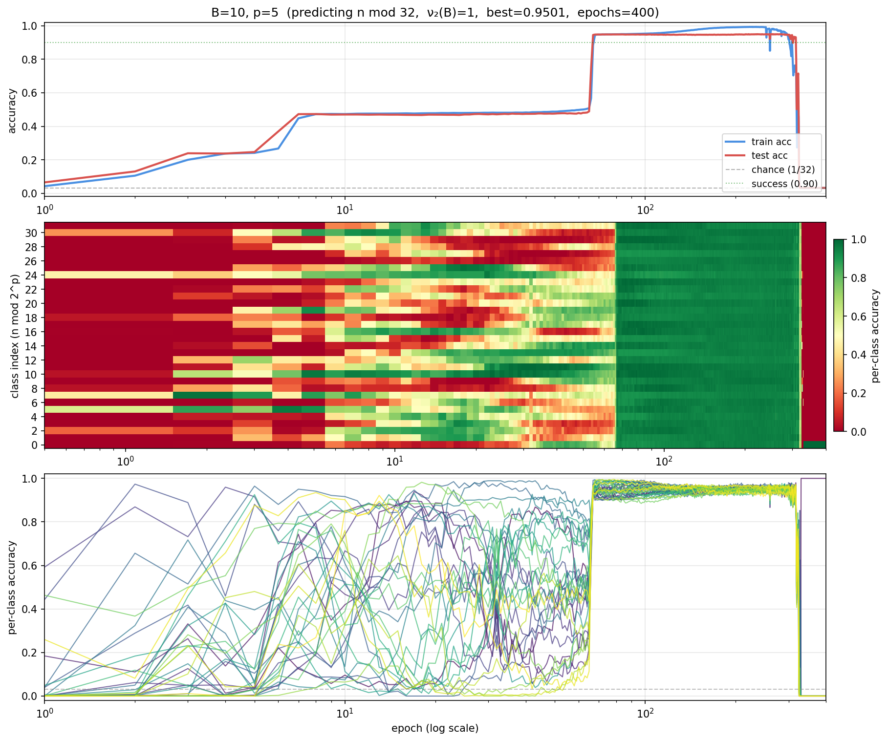
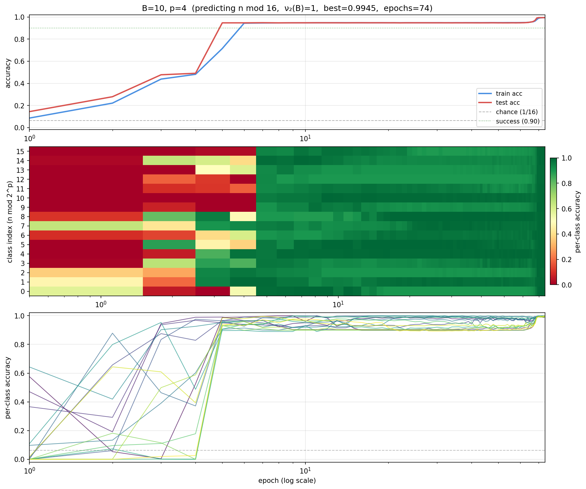

# Stepwise grokking — experiment results

Notes from the binary suffix sweep (April 2026). Regenerate figures with
`python analyze.py`. Data in `binary_suffix_experiment/`, figures in `figures/`.

## Sweep status

- **54 / 77 standard configs completed**, plus ablation variants.
- **1 clear failure:** B=10 p=8 (0.1279 after 1000 epochs — memorizes
  without generalizing).
- **53 successes** (best_acc ≥ 0.90).
- **23 remaining:** mostly odd bases at p ≥ 3 and all of B=17.

## Results table

| B  | ν₂(B) | p values ≥ 0.99 | notable runs |
|----|-------|-----------------|--------------|
| 2  | 1     | 1–8             | p=8: 21 epochs, smooth climb |
| 4  | 2     | 1–8             | all trivial (≤ 11 epochs) |
| 8  | 3     | 1–8             | all trivial (≤ 10 epochs) |
| 12 | 2     | 1–8             | all trivial (≤ 11 epochs) |
| 24 | 3     | 1–8             | all trivial (≤ 14 epochs) |
| 28 | 2     | 1–8             | p=8 took 27 epochs |
| 10 | 1     | 1–4             | p=5 (0.95, 400ep), p=6 (0.95, 400ep, **7 steps**), p=8 **FAIL** |
| 3  | 0     | 1, 2            | p=1: 28ep, p=2: **943ep** (grokked @ ~900) |
| 5  | 0     | 1, 2            | p=1: 21ep, p=2: **533ep** (grokked @ ~520) |
| 13 | 0     | 1               | p=1: 14ep, p ≥ 2 pending |
| 17 | 0     | —               | no completed runs |

## Progressive grokking — representative runs

All per-config figures have three panels: (1) train/test accuracy vs
epoch (log-x), (2) per-class accuracy heatmap, (3) per-class accuracy
lines.

### B=10, p=6 — the most steps (7 discrete jumps)


Seven detected step-ups over 400 epochs:

```
0.03 → 0.13  at epoch 3
0.13 → 0.24  at epoch 11
0.24 → 0.47  at epoch 70
0.47 → 0.57  at epoch 170
0.57 → 0.69  at epoch 179
0.69 → 0.83  at epoch 184
0.83 → 0.94  at epoch 190
```

After a 100-epoch plateau at ~0.47, four steps cascade in just 20 epochs
(170–190). This isn't one-step-per-bit — it's more like "unlock the
remaining bits near-simultaneously once the first two are secure."

### B=5, p=2 — late grokking with a 500-epoch plateau


Test accuracy camps at ~0.50 from epoch 20 to epoch 520, then
phase-transitions to 0.99 in ~30 epochs.

### B=3, p=2 — even later grokking (943 epochs)


Same shape as B=5 p=2 but the plateau lasts 900 epochs. Confirms the
pattern is reproducible across odd bases.

### B=10, p=5 — progressive staircase



Three plateaus at ~0.05, ~0.5, and ~0.95 with the final step at epoch
~60. The per-class heatmap shows classes flickering on and off during
the middle phase before all locking in.

### B=10, p=4 — two-step version



One fewer bit to learn. Two big steps: chance → 0.5 (epoch 5) → 0.99
(epoch 7). Adding one more bit (p=4 → p=5) makes the grokking delay an
order of magnitude longer.

### B=2, p=8 — smooth climb, no grokking


All 8 bits are directly available as base-2 digits. Classes converge in
a smooth wavefront, no stepwise dynamics. The model copies rather than
computes.

### B=10, p=8 — the failure case


Train accuracy → 1.0 by epoch 400; test accuracy stays at 0.13 for all
1000 epochs. Classic memorization without generalization. The model has
ν₂(10)=1 "free bit" from digit parity but cannot learn the remaining 7
bits of modular arithmetic.

## What the plateaus are learning

Analysis of per-class accuracy vectors at the plateau of each run
reveals what partial solution the model is sitting on.

### p=2 (4 classes): bit 0 learned, bit 1 not

**B=5, p=2** at the 0.50 plateau (epochs 89–520):

```
class 0 (binary 00): 0.97
class 1 (binary 01): 0.07
class 2 (binary 10): 0.03
class 3 (binary 11): 0.93
```

Pattern `[1, 0, 0, 1]` — the model predicts class 0 for every even `n`
and class 3 for every odd `n`. **Bit 0 (parity) is perfectly learned.**
Bit 1 is unlearned — the model defaults to the class where bit 1 equals
bit 0. The grokking step at epoch 520 is precisely the moment the model
learns bit 1.

**B=3, p=2** shows the same `[1, 0, 0, 1]` plateau structure but holds
it for 900 epochs.

### p=1 (2 classes): class collapse

**B=3, p=1**: class_acc = `[0.89, 0.11]` — predicts class 0 almost
always. **B=5, p=1**: class_acc = `[0.36, 0.64]` — slight bias toward
class 1. These are pure class collapses, not bit-learning.

### p ≥ 5 (32+ classes): no bit structure

**B=10, p=6** at the 0.47 plateau: per-class accuracy ~0.48 uniformly
across all 64 classes. Per-bit imbalances < 0.05 — no preferred bit
position. The model has ~1 bit of total information but it isn't aligned
with any specific bit of the class index.

**B=10, p=5** at 0.47: non-uniform subset of 32 classes, but the
structure doesn't map cleanly to individual bits. Bit 4 (highest) shows
the largest imbalance (0.125), suggesting the model prefers
low-index-class predictions.

### Summary

| p range | plateau pattern | interpretation |
|---------|----------------|----------------|
| p=1 | class collapse | model always predicts one class |
| p=2 | `[1, 0, 0, 1]` or similar | **bit 0 learned, bit 1 not** |
| p ≥ 5 | ~uniform ~0.5 across all classes | diffuse partial information, no bit alignment |

The "learn bits progressively low-to-high" story is cleanly confirmed
at p=2 and breaks down at higher p, where the partial solution is
unstructured.

## Positional encoding ablation (B=3, p=2)


Three variants tested on the same task:

| PE type | Epochs | Best Acc | Outcome |
|---------|--------|----------|---------|
| Learned (standard) | 943 | 0.9979 | Grokked at epoch ~900 |
| Learned + curriculum | 1000 | 0.9992 | **Grokked at epoch ~404 (2× faster)** |
| Sinusoidal | 1000 | 0.5031 | **Stuck at 0.5 plateau — never groks** |

**Key findings:**

1. **Positional encoding is load-bearing.** Sinusoidal PE learns the
   same partial solution (bit 0) as learned PE, but cannot make the
   phase transition to learn bit 1. Same architecture, same data, same
   LR — the encoding determines whether grokking happens.
2. **Curriculum accelerates grokking 2×.** Three phases: n ≤ 1,000
   (epochs 0–200), n ≤ 100,000 (200–400), full range (400+). The
   model groks within 4 epochs of entering phase 3. Training on short
   sequences first lets the model lock in easy structure; expanding to
   the full range triggers generalization.
3. **RoPE and ALiBi** runs are in progress on the cluster.

## Observations for the paper

1. **ν₂ hypothesis confirmed.** Bases with ν₂(B) ≥ 2 solve all p
   trivially (< 30 epochs). ν₂(B) = 1 (B=2, B=10) solves up to
   p ≈ ν₂(B) + 5 but fails at p=8 for B=10. Odd bases (ν₂=0) only
   solve p=1 easily and require 500–1000 epochs for p=2.
2. **Stepwise grokking is real.** Up to 7 discrete steps detected in a
   single run (B=10 p=6). The number of visible steps and their timing
   correlate with p − ν₂(B): more "non-free" bits = more steps and
   longer plateaus.
3. **Plateau structure is bit-aligned at low p.** At p=2 the plateau is
   precisely "low bit learned, high bit not." At p ≥ 5 the partial
   solution is diffuse and doesn't map to individual bits.
4. **Positional encoding controls grokking.** Sinusoidal PE prevents
   the phase transition entirely on B=3 p=2, while learned PE succeeds.
   This is a clean ablation result.
5. **Curriculum learning halves the grok time.** Starting with short
   sequences and expanding to the full range triggers grokking
   immediately upon reaching full data.
6. **B=10 p=8 is a clean failure case.** Train acc → 1.0, test stuck at
   0.13. The model memorizes without generalizing — the 7 non-free bits
   of modular arithmetic are too many to learn at this model size/budget.

## What's next

- **Finish the sweep:** B=17 (all p), B=13 p ≥ 2, B=3 and B=5 at p ≥ 3
  with 2000+ epoch budgets.
- **Complete PE ablation:** RoPE and ALiBi results pending.
- **Overview grid figure:** rows = bases (sorted by ν₂), columns = p,
  each cell = mini grokking curve. Main paper figure candidate.
- **Linear probes:** run probes on frozen encoder layers at the plateau
  vs post-grokking to test whether internal representations encode
  binary structure before the output layer learns to use it.
